# Diagramme entité-relation

Schéma de la base PostgreSQL, tel que défini dans
[`backend/src/prisma/contract.ts`](../backend/src/prisma/contract.ts) (Prisma ORM 8).
Les noms sont ceux des **tables SQL**. `PK` = clé primaire, `FK` = clé étrangère,
`UK` = contrainte d'unicité.

```mermaid
erDiagram
    quarters ||--o{ quarter_adjacencies : "quarterA"
    quarters ||--o{ quarter_adjacencies : "quarterB"
    quarters ||--o{ users : "rattache (QC)"
    quarters ||--o{ quarter_resources : "possede"
    quarters ||--o{ quarter_resource_amounts : "trace des reservations"
    quarters ||--|| district_severities : "niveau"
    quarters ||--o{ reservation_requests : ""
    quarters ||--o{ transfer_requests : "demandeur"
    quarters ||--o{ transfer_requests : "fournisseur"
    quarters ||--o{ transit_approvals : "quartier de passage"
    quarters ||--o{ calendar_events : ""
    quarters ||--o{ conflict_notifications : ""

    resource_types ||--o{ quarter_resources : ""
    resource_types ||--o{ quarter_resource_amounts : ""
    resource_types ||--o{ reservation_requests : ""
    resource_types ||--o{ transfer_requests : ""
    resource_types ||--o{ conflict_notifications : ""

    users ||--o{ transfer_requests : "cree"
    users |o--o{ transfer_requests : "decide"
    users |o--o{ transit_approvals : "approuve"
    users ||--o{ reservation_requests : "reserve"
    users |o--o{ audit_logs : "acteur"
    users ||--o{ notifications : "destinataire"
    users ||--o{ calendar_events : "cree"
    users |o--o{ severity_history : "modifie"
    users |o--o{ system_config : "modifie"

    district_severities ||--o{ severity_history : "historique"
    transfer_requests ||--o{ transit_approvals : "etapes de transit"
    transfer_requests ||--o{ conflict_notifications : "requestA"
    transfer_requests ||--o{ conflict_notifications : "requestB"

    system_config {
        int id PK "singleton (1)"
        int currentLevel "defaut 1"
        int retentionPercent "defaut 30"
        uuid updatedById FK "nullable"
        timestamptz updatedAt
    }

    quarters {
        uuid id PK
        QuarterCode code UK "A E W X Z"
        text name
        int treshHoldPercent "seuil de retention, defaut 30"
        boolean hasSeaAccess "E X Z"
        timestamptz createdAt
    }

    quarter_adjacencies {
        uuid id PK
        uuid quarterAId FK "UK (quarterAId, quarterBId)"
        uuid quarterBId FK "stockee dans les deux sens"
    }

    users {
        uuid id PK
        text email UK
        text passwordHash "bcrypt + pepper"
        text name
        OfficerRole role "QC LC CD"
        uuid quarterId FK "obligatoire pour un QC, null pour LC CD"
        timestamptz createdAt
    }

    resource_types {
        uuid id PK
        text code UK "ex MEDICAL_PERSONNEL"
        text name
        text unit
    }

    quarter_resources {
        uuid id PK
        uuid quarterId FK "UK (quarterId, resourceTypeId)"
        uuid resourceTypeId FK
        int initialQuantity "fixe, base du seuil"
        int currentQuantity "stock reel"
        timestamptz updatedAt
    }

    quarter_resource_amounts {
        uuid id PK
        uuid quarterId FK "UK (quarterId, resourceTypeId)"
        uuid resourceTypeId FK
        int amount "cumul reserve par le QC"
    }

    district_severities {
        uuid id PK
        uuid quarterId FK "UK"
        int level "1 a 5"
        timestamptz updatedAt
    }

    severity_history {
        uuid id PK
        uuid districtSeverityId FK
        int previousLevel
        int newLevel
        uuid changedById FK "nullable"
        timestamptz createdAt
    }

    reservation_requests {
        uuid id PK
        uuid quarterId FK
        uuid resourceTypeId FK
        int quantity
        uuid requestedById FK
        ReservationStatus status "ACTIVE RELEASED EXPIRED CANCELLED"
        timestamptz createdAt
        timestamptz releasedAt "nullable"
    }

    transfer_requests {
        uuid id PK
        uuid requestingQuarterId FK "recoit"
        uuid supplyingQuarterId FK "fournit"
        uuid resourceTypeId FK
        int quantity
        TransferRouteType routeType "DIRECT TRANSIT MARITIME"
        TransferStatus status "PENDING IN_TRANSIT COMPLETED REJECTED"
        int disasterLevelAtRequest
        uuid createdById FK
        uuid decidedById FK "nullable"
        RejectionCode rejectionCode "nullable"
        text rejectionReason "nullable"
        timestamptz createdAt
        timestamptz decidedAt "depart du trajet"
        timestamptz completedAt "arrivee"
    }

    transit_approvals {
        uuid id PK
        uuid transferRequestId FK "UK (transferRequestId, order)"
        uuid transitQuarterId FK
        int order "position dans la chaine"
        TransitApprovalStatus status "PENDING APPROVED REJECTED"
        uuid approvedById FK "nullable"
        timestamptz decidedAt "nullable"
        timestamptz createdAt
    }

    conflict_notifications {
        uuid id PK
        uuid requestAId FK
        uuid requestBId FK
        uuid resourceTypeId FK
        uuid quarterId FK
        boolean resolved
        timestamptz createdAt
    }

    audit_logs {
        uuid id PK
        uuid actorId FK "nullable"
        text action
        text entityType
        text entityId "nullable"
        int statusCode "nullable"
        json detail "nullable"
        timestamptz createdAt
    }

    notifications {
        uuid id PK
        uuid userId FK
        text type
        json payload
        boolean read
        timestamptz createdAt
    }

    calendar_events {
        uuid id PK
        text title
        text description "nullable"
        uuid quarterId FK "nullable"
        timestamptz startAt
        timestamptz endAt "nullable"
        text type
        uuid createdById FK
        timestamptz createdAt
    }
```

## Enums

| Enum | Valeurs |
|---|---|
| `QuarterCode` | `A` (Apex), `E` (Echo), `W` (Warden), `X` (Xeno), `Z` (Zion) |
| `OfficerRole` | `QC`, `LC`, `CD` |
| `ReservationStatus` | `ACTIVE`, `RELEASED`, `EXPIRED`, `CANCELLED` |
| `TransferRouteType` | `DIRECT`, `TRANSIT`, `MARITIME` |
| `TransferStatus` | `PENDING`, `APPROVED`, `REJECTED`, `IN_TRANSIT`, `COMPLETED`, `CANCELLED` |
| `TransitApprovalStatus` | `PENDING`, `APPROVED`, `REJECTED` |
| `RejectionCode` | `NOT_ADJACENT`, `INSUFFICIENT_SURPLUS`, `BELOW_RETENTION_THRESHOLD`, `PERMISSION_DENIED`, `LEVEL_TOO_LOW`, `TRANSIT_NOT_APPROVED`, `MARITIME_NOT_ALLOWED`, `SELF_TRANSFER`, `INVALID_QUANTITY`, `XENO_PRIORITY_PENDING` |

## Points de conception

- **Seuil de rétention** : jamais stocké par ressource. Il est calculé à la volée,
  `ceil(initialQuantity × treshHoldPercent / 100)`, pour que le passage à 15 % décidé
  par le CD (niveau 5) s'applique immédiatement à tous les stocks.
- **`quarter_resources.currentQuantity`** est le stock réel, modifié par les
  réservations, transferts et réquisitions. `initialQuantity` ne change jamais.
- **`quarter_resource_amounts`** n'est pas un stock : c'est le cumul de ce que
  chaque QC a réservé dans son propre quartier.
- **Adjacence** stockée dans les deux sens (A→E et E→A) pour simplifier les requêtes.
- **Transfert** : `decidedAt` marque le départ (passage `IN_TRANSIT`), `completedAt`
  l'arrivée (1 min, 2 min en maritime), après quoi le demandeur est crédité.
